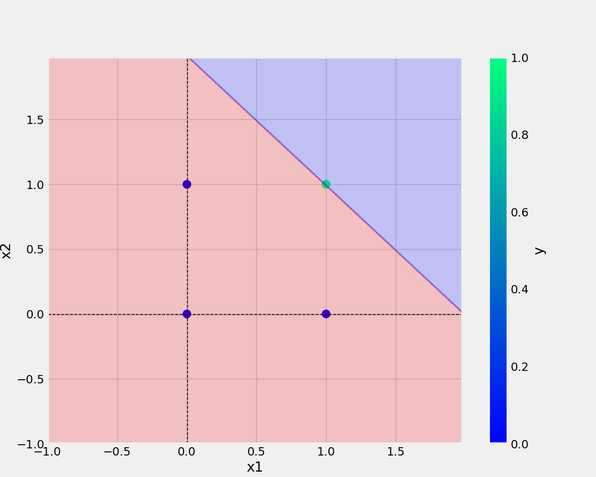

# oneNeuron
oneNeuron| Perceptron


## Add URL-
[Github Handbook](https://guides.github.com/introduction/git-handbook/)

OR,
<a href="https://guides.github.com/introduction/git-handbook/">Github Handbook</a>

## Add Image-


OR,


## Python code

``` python
def main(data, eta, epochs, filename, plotFileName):
  

    df = pd.DataFrame(AND)
    print(df)
    X,y = prepare_data(df)

    model = Perceptron(eta=eta, epochs=epochs)
    model.fit(X, y)

    _ = model.total_loss() ##Dummy variable _


    save_model(model, filename=filename)
    save_plot(df, plotFileName,model)
```

``` bash

git add . && git commit -m "docstring updated" && git push 
origin main

```

## dataset

x1 | x2 | y
-|-|-
0|0|1
0|1|0
1|0|0
1|1|1

        "x1": [0,0,1,1],
        "x2": [0,1,0,1],
        "y": [0,0,0,1],
    